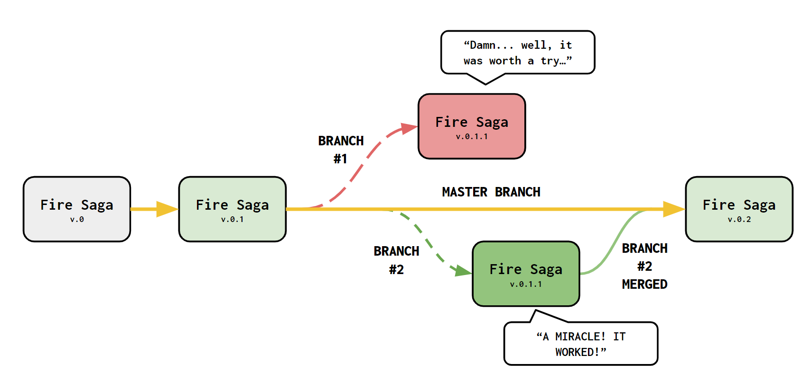

```{r setup, include=FALSE}
devtools::load_all()
```


### **Okay, cut to the chase, WTF is GIT?** 

Haven't we all been in that situation where our folder with all the code files for our project looks a little bit like this?: 

<center>

</center>

Keeping track of all changes we make in our work is hard! Sometimes we have multiple files and the difference between them only falls to one or two lines of code that actually do the trick and make our model work. **Why save an entire new file if only a line or two are different?** Is there a way to only record these changes? Funny you ask! There is! And it is called **Version Control**.

**Version control** is a class of system used mostly for software engineering that allows us to manage changes within our software and **GIT** is one of these systems. 

### **But how does GIT work?** 

The first thing to understand how **GIT** works is the concept of a **Commit**. A **commit is the recording any modifications you make to existing files** generating in the process a new version of the original/s. A commit can include a single or multiple files even full folders and it accounts for not only modifications but also additions or deletions within the file. Below I add an graph schematic of what a commit is, for now it is quite simple, but I'll add a bunch of levels of complexity so be sure you are rock solid before jumping to the next step. 

<center>
{width=500}
</center>

The next important concept to understand is **Repository**. A **repository is the project that is being held under version control, all the files or folders whose modifications will be tracked**. A repository is equivalent to your entire project. Complementarily, another improtant idea is that of the **Push**. A **push is a single or multiple commits that establish a new version of your repository**.  Below I show a schematic of how this works:

<center>
{width=600}
<br>
</center>
<figcaption>Let's say that we are developing a **version control repository** called *Fire Saga*. Within it we have two files (file_1.R and file_2.R). We make a small modification to them both, saving each modification as a new **commit**. Once we consider that there are enough commits for a significant change in our project we **push** them to create a new version of the *Fire Saga* repository. 
</figcaption>
<br>

All **Pushes** will be recorded within your repository and you'll be able to access them if you mess something up and want to go back to a previous version of your work. If that happens **the action of recovering a version of your repository** is called **Pull** 

However, what if you are exploring a new model or treating your data in a way that you are not really sure if it will work or not. GIT offers an awesome solution for that and it is called **Branching**. You can create a new **Branch** from your original repository and try out stuff, if it works then awesome you can **Merge** the brach your "let's try this" branch with your main branch and continue working with your repository as usual. Here's how it works: 

<center>

<br>
</center>
<figcaption> 
Imagine that you keep working on the *Fire Saga* repository. All updates to the project you make are saved in a **master branch** (indicated in gold above because, why not?) where you have all versions of your repository. One day you wake up with a bold idea but you are not sure if it will work, to try it out you create a **branch** (Branch #1) above to see test that out. Unfortunately it doesn't work but no problem, you can always **pull** the previous version of your project and forget about it. Two days later you are like "Wait a minute! I know what I was missing" so you create another **branch** to see if your new idea works (Branch #2). It worked! Now you wanna keep that as your main working line. To do that, you just **merge** your branch with the master branch and you create a new version of the project! Awesome!
</figcaption> 
<br> 

### **Could you give a real world example?** 

Okay let's visualize all this stuff about **GIT** with a quick example using R. Let's say that we are working on a function that tells us how long will it take for Valentina to make a group chat about a social event depending on the number of people potentially participating:

```{r}
time_till_val_group <- function(n_people){
  
  # linear relationship between time and people 
  time_till_group <- 10 - 0.1*n_people
  
  # return time until chat group
  return(time_till_group)
  
}
```

This function predicts that time until Val makes a chat group decreases linearly with the number of people participating. We can take a look at it in action: 

```{r, fig.align='center', fig.width=6}
# exemple values for the number of people participating
participants <- seq(0,50, by = 1)

# predicted time until chat according to the function earlier 
time <- time_till_val_group(participants)

# let's check that in a plot 
plot(participants, time, type = "l", lwd = "2", 
     xlab = "Number of Participants", ylab = "Time until Val makes chat group (seconds)")
```

**I'm sure we can all agree that this relationship makes absolutely no sense! Valentina takes way less time than this to make a chat group for social events!** We need to write a better function. What about an exponential relationship?: 

```{r}
time_till_val_group <- function(n_people){
  
  # exponential relationship between time and people 
  time_till_group <- n_people^-0.9 #### LINE CHANGING
  
  # return time until chat group
  return(time_till_group)
  
}
```

Let's see how that looks now: 

```{r, fig.align='center', fig.width=7}
# calculate predicted times again
time <- time_till_val_group(participants)

# let's check that in a plot 
plot(participants, time, type = "l", lwd = "2", 
     xlab = "Number of Participants", ylab = "Time until Val makes chat group (seconds)")
```

**Now that's much better! We are in the miliseconds range when we have 20 or more participants! Much more close to reality**.  Instead of saving a whole new file with a new version of Val's function we can just **commit** and if she get's annoyed we can always **pull** back the older (*less realistic*) version of the file. Below I represent this process schematically, notice in the right panel that the changes in the function are highlited in red. Those changes are the ones **GIT** will record for you. 

<br>
<center>

</center>
<br>

### **I'm convinced! How do I get GIT on my device?** 

To get **GIT** on your device just download it from this link: https://git-scm.com/book/en/v2/Getting-Started-Installing-Git

You can also learn more about **GIT** and version control in this link:
https://git-scm.com/about/branching-and-merging

On other pages within this repository you will learn how to integrate R with Git and GitHub! Your journey into awesomeness has just begun! 


