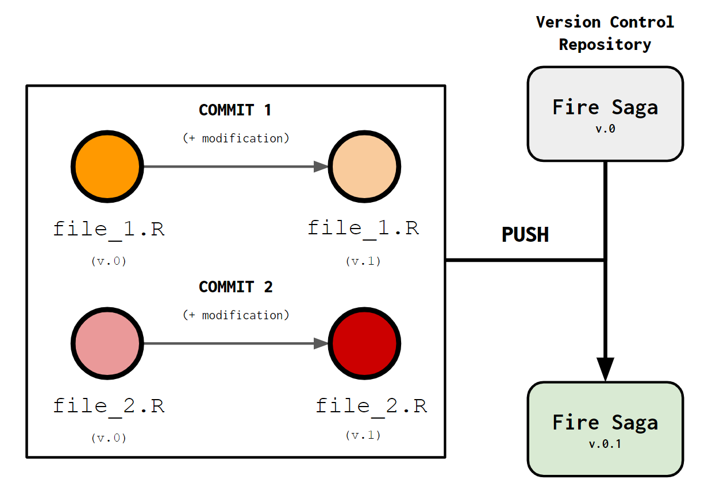

```{r setup, include=FALSE}
devtools::load_all()
```

### **Cut to the chase, WTF is GIT?** 
<br>
Haven't we all been in that situation where our folder with all the code files for our research looks a little bit like this?: 

<br>
<center>

</center>
<br>

Saving the changes we make in our files over and over again can result in an insane amount of versions for the same thing with only tiny modifications. Even though the differences between files are minimal, each new version takes unnecessary storage space. Not only that, but also keeping track of all changes is hard! I'm sure we have all been in that *Wait! Which one was ACTUALLY the good version?* situation. Wouldn't it be nice to have system that would kept track of the changes we made on files? That system is called **Version Control**.

A **Version control** system is a class of computer program used mostly for software engineering that allows you to manage changes within your software. There is a bunch of **Version Control** systems that are commonly used but the most famous and widely used one is `GIT`. Let me show you what `GIT` is about: 

### **How does GIT work?** 
<br>
The easiest way to visualize how `GIT` works is through **graph diagrams**. In the explanation below I'll use plenty of these so, as a reference, think of circles as files, color of these circles as file versions and arrows as modifications made on these files. `GIT` has a specific lingo that is very important to understand. Let me start by the concept of **Commit**

 A **commit is the recording any modifications you make to existing files or data** generating in the process a new version of the original. A commit can include a single or multiple files, even full folders, and it accounts for not only modifications but also additions or deletions within the file. Schematically it works like this:  
<br>
<center>
{width=500}
</center>
<br>

The next important concept to understand is **Repository**. A **repository is the project that is being held under version control, all the files or folders whose modifications will be tracked**. A repository is equivalent to your entire project. For example, if you set a specific folder to be tracked using `GIT` all changes you make in the files within that folder will be tracked. 

Complementarily, another important idea is the**Push**. A **Push consists of a single or multiple commits put together  that establish a new version of your repository**. A **Push** groups commits that are made within the same general idea. For example, let's say that you have a new idea and you change two different files independently as a result of it. Each change should be a commit and they should be put together in a push.  Below I show a schematic of how pushing and repositories work: 

<br>
<center>
{width=600}
</center>
<br>

Let's say that you are developing a version control repository called `Fire Saga`. You have two files (`file_1.R` and `file_2.R`). You make a small modification to them both, saving each modification as a new commit. Once you consider that there are enough commits for a significant change in our project we push them to create a new version of the *Fire Saga* repository. 

All pushes will be recorded within your repository and you'll be able to access them if you mess something up and want to go back to a previous version of your work. If that happens **the action of recovering a version of your repository** is called **Pull**, obvious enough right? 

However, what if you are exploring a new model or treating your data in a way that you are not really sure if it will work or not?. `GIT` offers an awesome option for that called **Branching**. You can create a new **Branch** from your original repository and try out stuff, if it works then Awesome! you can **Merge** your *let's try this* branch with your master branch and continue working with your repository as usual. Here's how it works: 

<center>

</center>
<br> 

Imagine that you keep working on the *Fire Saga* repository I presented earlier. All updates to the project you make are saved in a **master branch** (indicated in gold above because, why not?) where you have all versions of your repository. One day you wake up with a bold idea but you are not sure if it will work. To try it out you create a **branch** (`Branch #1`) to test it out. Unfortunately, it doesn't work but no problem! You can always **pull** the previous version of your project and forget about it. Two days later you are like: *Wait a minute! I know what I was missing!* so you create another **branch** to see if your new idea works (`Branch #2`). It works! Now you want to keep that as your main working branch so you just **merge** your branch with the master branch and you create a new version of the repository! Awesome!

<br>
<center>
{width=600}
  <br>
  <em> The name for the repository "Fire Saga" comes from the fictional band name from the "Eurovision" movie from Netflix, it's an inside joke kind of, don't judge me. </em>
</center>
<br>

### **Could you give a real world example?** 
<br>
This all sounds good in paper but still a little abstract right? Let's visualize all this stuff about `GIT` with a quick example using `R`: 

Say that you are working on a function that tells you how long will it take for **Valentina** to make a group chat (text, whatsapp, a goddamn email, whatever...) about a social event depending on the number of people potentially participating. The function could look like this: 

```{r}
time_till_val_group <- function(n_people){
  # linear relationship between time and people 
  time_till_group <- 10 - 0.1*n_people
  # return time until chat group
  return(time_till_group)}
```

**_NOTE:_**: If you are not familiar with how to write or use functions in R here is an amazing tutorial: https://adv-r.hadley.nz/functions.html

This function predicts that the time it takes for Val to make a group chat decreases linearly with the number of people participating. We can take a look at it in action: 

```{r, fig.align='center', fig.width=6}
# exemple values for the number of people participating.
participants <- seq(0,50, by = 1)
# predicted time until group chat according to the function. 
time <- time_till_val_group(participants)
# let's check that in a plot.
plot(participants, time, type = "l", lwd = "2", 
     xlab = "Number of Participants", ylab = "Time until Val makes chat group (seconds)")
```
<br>
**I'm sure we can all agree that this relationship makes absolutely no sense! Val takes way less time than this to make a chat group for social events!** We need to write a better function. What about an exponential relationship?: 

```{r}
time_till_val_group <- function(n_people){
  # exponential relationship between time and people 
  time_till_group <- n_people^-0.9 #### LINE CHANGING
  # return time until chat group
  return(time_till_group)}
```
<br>
Let's see how that looks now: 

```{r, fig.align='center', fig.width=6}
# calculate predicted times again
time <- time_till_val_group(participants)
# let's check that in a plot 
plot(participants, time, type = "l", lwd = "2", 
     xlab = "Number of Participants", ylab = "Time until Val makes chat group (seconds)")
```

**Now that's much better! We are in the milliseconds range when we have 20 or more participants! Much closer to reality**.  Instead of saving a whole new file with a new version of Val's function we can just **commit** the changes and if she get's annoyed we can always **pull** back the older (*less realistic*) version of the function. Below I represent this process schematically, notice in the right panel that the changes in the function are highlighted in red. Those changes are the ones `GIT` will record for you. 

<br>
<center>

</center>
<br>

### **I'm convinced! How do I get `GIT` on my computer?** 

To get `GIT` on your device just download it from this link: https://git-scm.com/book/en/v2/Getting-Started-Installing-Git

You can also learn more about `GIT` and version control in this link:
https://git-scm.com/about/branching-and-merging

**On the next pages of within this repository you will learn how to integrate Git with R and GitHub! Your journey into awesomeness has just begun!**


