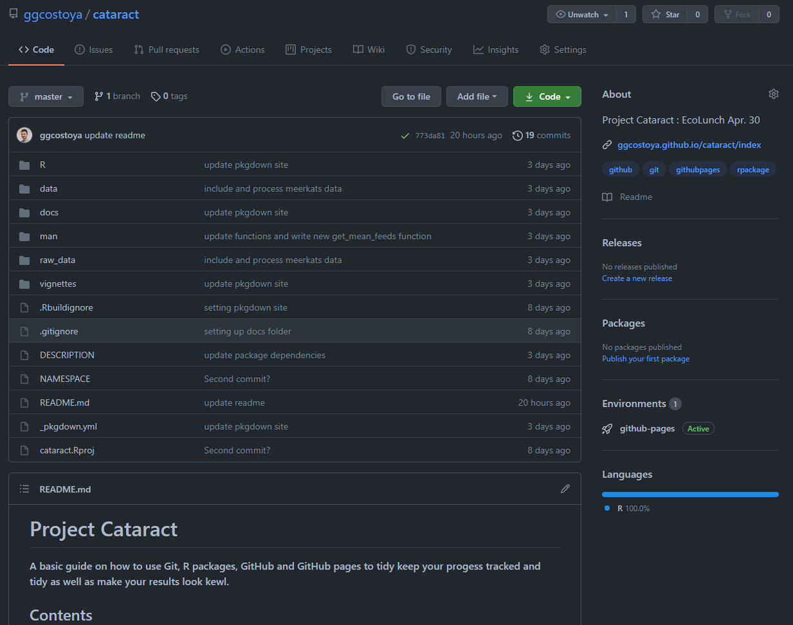
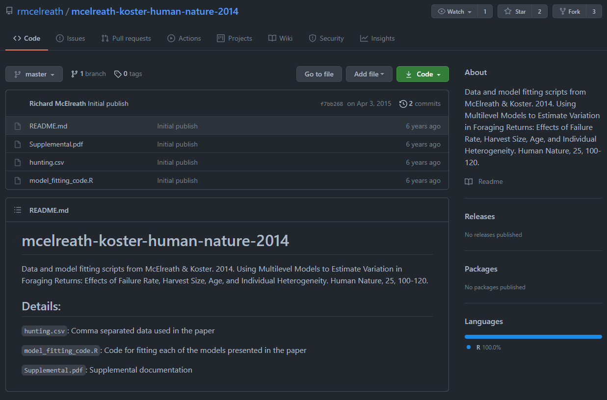
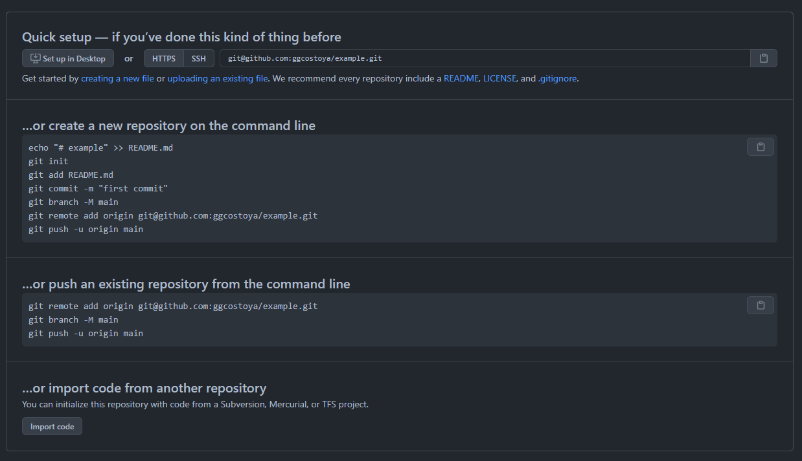
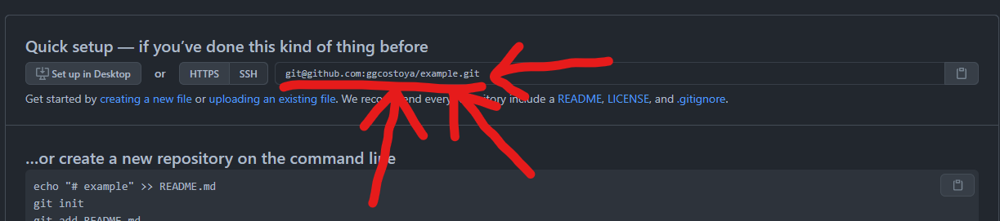

```{r setup, include=FALSE}
knitr::opts_chunk$set(echo = TRUE)
devtools::load_all()
```

### **Okay, point, get to the damn, what is GitHub?** 

Now that you (hopefully) have an idea of what **GIT** it is time to talk about the tool that makes version control easy to use: **GitHub**. 

**GitHub** is a source code managing website that allows you to store, visualize and share any version control  coding projects you have. If you are in this section I encourage you explore https://github.com/ggcostoya/cataract. which will lead you to the **GitHub** repository of `cataract`, the name I gave to the repository and `R` package associated with the Ecolunch talk. Here is how that page looks like:

<br>
<center> 

</center>
<br>

The most awesome thing about **GitHub** is that it is an **open source** collaborative platform. In it you can create your own profile, follow people and most importantly **check the source code** for functions you are working with. 

For example, I am pretty sure that most of you have heard about `ggplot2` at some point right? Well, `ggplot2` is an `R` package developed by God, I mean, **Hadley Wickham**. We can go to Hadley's profile (conveniently his username is *hadley*): https://github.com/hadley

<br>
<center> 

</center>
<br>

There, we can check for the source code of the `tidyverse/ggplot2` repository: https://github.com/tidyverse/ggplot2, which, as you can see if you click the link, is much more complicated than `cataract`. 

Once we are there we can search for the actual code of functions that we use a lot, for example, the actual code for the `geom_boxplot` function: https://github.com/tidyverse/ggplot2/blob/master/R/geom-boxplot.r. It is right there available, you can even download it and modify it yourself if you want to for free! 

### **Use GitHub for your paper's supplementary materials**

A very common use of GitHub to store and present the supplementary materials of your paper. Here is an example by another idol of mine **Richard McElreath**: 

McElreath published a paper in *Human Nature* in 2014 titled *Using Multilevel Models to Estimate Variation in Foraging Returns* (you can check it out here: https://link.springer.com/content/pdf/10.1007/s12110-014-9193-4.pdf, it is pretty cool actually) 

He provides all code and data he used in his GitHub page: https://github.com/rmcelreath/mcelreath-koster-human-nature-2014. Here's how it looks: 

<br>
<center> 

</center>
<br>

The code he used (`model_fitting_code.R`), the data he used (`hunting.csv`) and the supplementary materials (`Supplemental.pdf`), all available for anyone to use and recheck that he did good science. I can even download his data for myself, include it in my own package and check it out! Here is a sample of it! Cool right? 

```{r}
head(hunting_mcelreath)
```
<br> 

**_NOTE_**: Remember that the raw data can be found in the `\raw_data` folder where it is cleaned (`hunting_data_prep.R`) and finally stored for package used in the `\data` folder of `catract`. 


### **Using GitHub in Combination with an R package** 

Considering what we have been talking about in the context of **Project Cataract**, the natural progression is to combine GitHub with your R package workflow. As an example, I have made public one of the R package I have been working on as part of my PhD. research, code name **Project Limón**: https://github.com/ggcostoya/limon

### **How do I do this? Connect GitHub with your R package**

Let's say that you are convinced! That you wanna be part of the *kewl* kids and that you want to get into this **GitHub** and **`R` packages** thing. Below is a step by step tutorial on how to do it. All this stuff might sound intimidating and it is! It is normal if you feel overwhelmed or if things don't work on the first try. My advice is being patient and knowing that *a huge effort comes with a huge reward*. And remember that you can always contact me (guille@nevada.unr.edu) for help! 

#### **Step 1 : Download GIT**

If you haven't already, download **GIT** in your computer! You'll find the link here: https://ggcostoya.github.io/cataract/articles/git.html 

#### **Step 2: Create an R package**

If you haven't done it already create one, here are some instructions: https://ggcostoya.github.io/cataract/articles/r_packages.html 

#### **Step 3: Make sure your R package is using GIT**

This should work automatically but just to be sure check that your package is using `GIT` as your version control system. To check it go to: `Tools` (upper bar of options next to `Profile` and `Help`) -> `Version Control` -> `Project Setup` -> `SVN/GIT` -> select `GIT` as the version control system. 

This might ask you to initialize a new `GIT` repository and restart **Rstudio**, that is totally fine.

#### **Step 4: Create a GitHub account**

Go to: https://github.com. The instructions are super easy to follow and in the process you will find much more information than I could ever provide here. 

#### **Step 5: Connect GitHub and your computer**

This is, by far, the most confusing bit. I understand this might sound intimidating but just be calm, it's going to be okay. Once again, if you have any trouble doing this I am happy to help, email me or come visit me at the **Logan Lab** and we will figure it out! Here's what you need to do

* Let's start by opening **GitBash**, a program that you automatically downloaded when you got `GIT`. 

* We will need to generate an **SSH key**, which is the key that connects your computer to version control repositories like GitHub. To do so, follow the instructions explained here: https://docs.github.com/en/github/authenticating-to-github/generating-a-new-ssh-key-and-adding-it-to-the-ssh-agent

**_NOTE_**: If you have worked with **GitHub** before you might already have an **SSH key**, here are some instructions to check if you already have one:https://docs.github.com/en/github/authenticating-to-github/checking-for-existing-ssh-keys

* Finally, you will need to tell GitHub about your SSH key so your computer can interact with it, you can do so following these instructions: https://docs.github.com/en/github/authenticating-to-github/adding-a-new-ssh-key-to-your-github-account

#### **Step 6: Create a Repository on GitHub**

GitHub will offer you that possibility when you are setting up your account. **Do it!** For now, it doesn't matter if the repository is public of private but in the future it will so for now keep it public. Also, remember to pick the same name for your GitHub repository as the one you used for your `R` package. Right after creating the repository GitHub will open a page like this, **DO NOT CLOSE IT**, you will need that later: 

<br>
<center> 

</center>
<br>


#### **Step 7: Connect your R package to your GitHub repository**

This is also a tricky part, I know it is scary but you will have to use the terminal. No worries! I'll show you how: 

* First, open an **Rstudio** session with your `R` package. (you can do so by clicking on the `.Rproj` file in your package folder)

* Second, on the lower left hand panel next to `Console` there should be a label for `Terminal`. Go there. 

* To initialize `GIT` in your `R` package you have to type in the `Terminal`: 

```{bash, eval = FALSE}
git init
```

**_NOTE_**: Be careful with the spacing! You are typing `GIT` commands and the spaces between words are important! 

* Then we are going to make our first **Commit**, remember that a commit is tracking any changes occurring in the files of your package. At first, the commit will track all files that were generated when you created your `R` package (`.gitignore`, `\R` etc.( . To commit type the following in the terminal: 

```{bash, eval = FALSE}
git commit -m "first commit"
```

* Now add the first commit to `GIT` (The space between `add` and `.` here is very important!)

```{bash, eval = FALSE}
git add .
```

* Finally, to **Push** the commit to **GitHub** type:

```{bash, eval = FALSE}
git push -u "SSH key from GitHub"
```

Above, where it says "*SSH key from GitHub*" you will need to copy the **SSH key** of your GitHub repository. Remember when I told you not to close the page that popped up when you created the GitHub repository? Here's where it comes to play! You'll find that SSH key here: 

<br>
<center>

</center>
<br>

If everything has gone correctly the files from your `R` package should now appear on your GitHub repository! Awesome! 

#### **Step 8: Working with Git + `R` packages + GitHub consistently **

If you go back to **Rstudio** you should see on the upper right hand panel a tab called `Git`. That panel will allow you to track any changes (modifications, additions, deletions etc.) that you make to your files. You will be able to select the changes you want for a particular **commit** as well as having the option to **Push** those commits to GitHub as well as  **Pull**ing any changes you've made through GitHub directly. 


