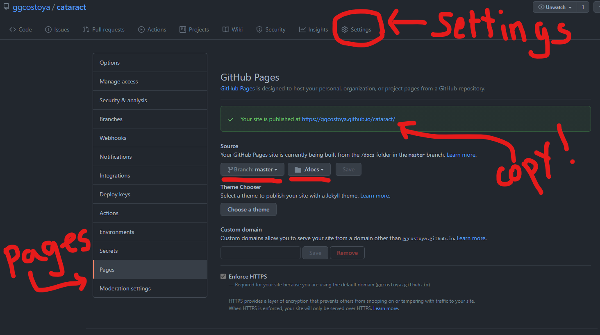
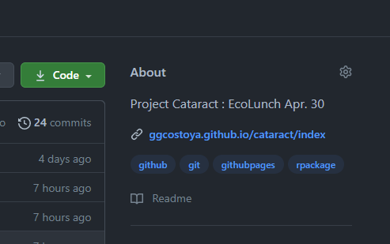
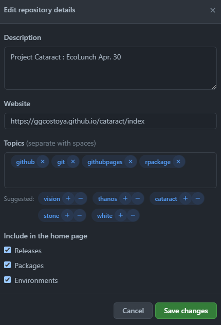

```{r setup, include=FALSE}
knitr::opts_chunk$set(echo = TRUE)
devtools::load_all()
```

### **Aim of the Game** 

What you are looking at right now is a **GitHub** page. This is a website-like platform I have developed to complement whatever I blabbed about during the Ecolunch talk. Here I have been able to expand on things I did not have time to cover during the talk and add detailed instructions on how to do some cool stuff. 

My goal here is to explain how you guys can use this kind of page as a way to develop your research work as well as having an amazing tool to share and present your results. If you want to see an example of someone who does that amazingly check: https://matthieu-bruneaux.gitlab.io/isotracer/ 

All pages here were made using **`R` markdown** in combination with an `R` package called **pkgdown**. In this page I'll explain briefly how `R` markdown works, how to build a website like this and how to link it to your **GitHub** repositories so you can apply it to your research. 

### **What is `R` markdown?**

In the simplest way I can put it, **`R` markdown** is a type of `R` document that combines code with text to generate a website-like page (It is very similar to **Jupyter Notebook**, ask **Trevor** about that!). This page was made using **`R` markdown**  and in it I can include **chunks** of code in between paragraphs that not only show the code used but also the output: 

```{r}
print("BITCONNEEEEEECT!")
```

<br>
<center>
{width=600}
  <br>
  <em>  If you, understandably, have no idea WTF is this about check: https://www.youtube.com/watch?v=yIL9wLxG01M".</em>
</center>
<br>

To create your own **`R` markdown** documents (`.Rmd`) in your `R` studio session you can go to `File`-> `New File` -> `R markdown`. 

I won't extend too much on how to use it because **Xie**, **Allaire** & **Grolemund** wrote a fantastic free book that will tell you all about it: https://bookdown.org/yihui/rmarkdown/

### **How to build your website**

Let's say that your paper has a bunch of different analysis you need to explain. For each one, you make an **`R` markdown** document explaining it beautifully. It would be cool to have a website compiling all your very important stuff in one place right? Let me show you how to do it through these two very straightforward steps: 

#### **Step 1: Create a `vignettes` folder**

Remember when we talked about the elements of your R package? (https://ggcostoya.github.io/cataract/articles/r_packages.html#elements-of-your-r-package-1) To generate a website you will need to create a folder called `vignettes` where you will store all the `.Rmd` documents you write. 

#### **Step 2: Generate the website** 

To do so you will need to type the following command on your `R` console: 

```{r, eval = FALSE}
pkgdown::build_site()
```

<br> 

You will see that it takes a while to run but that once it is done the website will pop up. On top of that, two things will appear on your `R` package folder: 

* `/docs`: The function `pkgdown::build_site()` transformed all the **`R` markdown** files from your package's `/vignettes` folder into `HTML` documents (`HTML` is another programming language, just like `R`, in which most websites are written). All these `HTML` documents are stored in the `\docs` folder. My advice: *best not to touch it unless you know what you are doing! *

* `_pkgdown.yml`: This is an extremely important file since it will determine the structure of your website. As a reference for your future projects, I encourage you to check the `_pkgodown.yml` file for `cataract` which you can find in the **GitHub** repository at: https://github.com/ggcostoya/cataract/blob/master/_pkgdown.yml (Again, so cool to have open source code you can copy and/or get inspired from right?). 

### **Link your website to your GitHub repository** 

Now that you have the website it would be even cooler if you could share it with people right? You could use it to present the supplementary materials of your papers, share and explain your progress to colleges or even use it as promotion material for yourself! Let's see how you can do that, again, in steps: 

#### **Step 1: Remove the `/docs` folder from your `.gitignore` file**

When you created your package one of the files you generated was `.gitignore`, which is used to indicate files or documents that should not be tracked by **GIT**. You will see that the `\docs` folder is there now. We don't want it! Erase it from `.gitignore`. 

#### **Step 2: Tell GitHub where to look for your website** 

By now you should have a GitHub repository linked to your `R` package, now we want to tell GitHub to look in the `/docs` folder to generate a website. There are many ways to do this, most of them much more elegant than this, but this is how I do it: 

Within your repository  open `Settings` -> `Pages`. There you will have the option to determine the `Source`. You want to select your `master` branch and your `/docs` folder (shown below). Save your changes and a message claiming that *Your site is published at bla bla bla* should appear. Copy the link for your website. 

<br>
<center> 

</center>
<br>

#### **Step 3: Add your website link to the GitHub Repository Description** 

If you go back to the main page of your GitHub repository (**<> Code**) you will see that in the right hand side there is a section called **About**. To change it click on the gear symbol on the top right

<br>
<center> 

</center>
<br>

That will open a page where you can write a description of your repository, add some topics and paste a link to a website. That's where you'll paste what you copied earlier. Save Changes and you are good to go! 

<br>
<center> 

</center>
<br>


