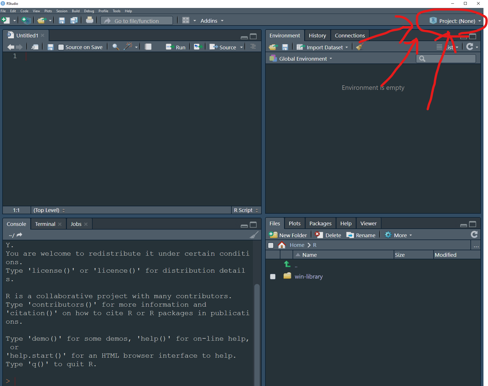
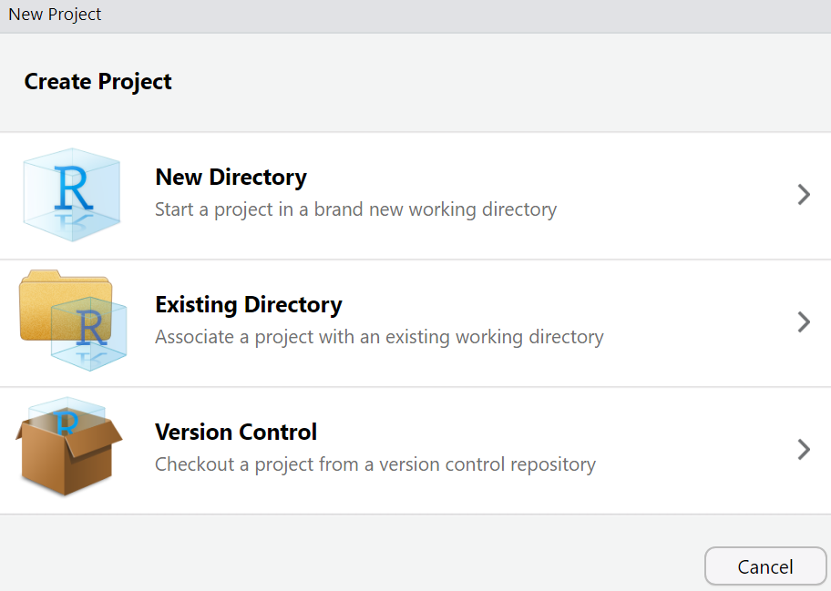
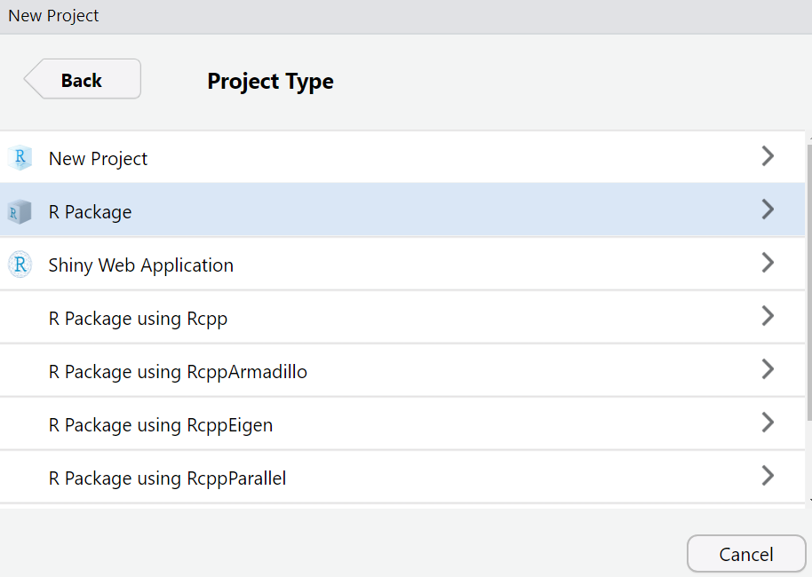
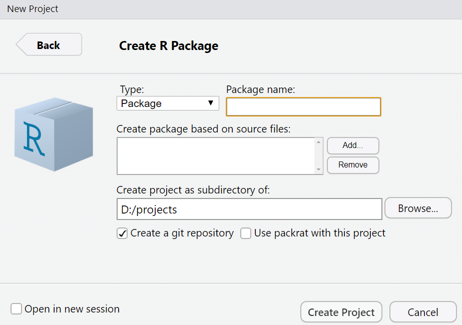
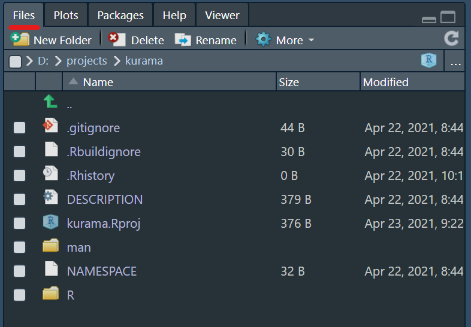

```{r setup, include=FALSE}
knitr::opts_chunk$set(echo = TRUE)
```

### Aim of the Game

Have you ever been in that situation where your R script is longer than the Wall of China? Something like: 

```{r, eval = FALSE}
# first remove everything on the environment
rm(list = ls())

# then install the packages you need 
install.packages("ggplot2")
install.packages("nlmer")
install.packages("rethinking")
install.packages("whatever")
install.packages("some bullshit I need 4 just that one line")

# then load the packages 
library(ggplot2)
library(nlmer)
library(rethinking)
library(whatever)
library(some bullshit I need 4 just that one line)

# then load the data 
data <- read.csv(C:/was_it_this_folder?/within_this_one?/not_sure/maybe_here?/data.csv)

# then tidy the raw data and only keep what you need for your analysis 
actual_data <- data.frame(unicorn_id = data$UniCorn_Identity,
                          horn_length = data$Length_of_THe_horn_of_the_UNicorn, 
                          weight = data$W_of_the_Unicorn_when_born)

# to then finally be able to run the fricking analysis 
model <- lm(horn_length ~ weight, actual_data)

# to then get a fricking ERROR AGAIN GODDAMN IT! 

```


That is waaay too long and sooo frustrating! But worry no more! There is a way to solve this and it is treating your entire project as an **R package**. Let me explain

### What is an R package?

An **R package** is a type of **R project**, in other words, a folder you set up and in which you can do all your project work. An R package works exactly like those packages you install and load every time you load a script (i.e `ggplot2`, `nlmer` etc.) when you need a function that does something useful. However, this time, you will be the person behind the scenes! A package can include, **functions**, **data**, and all kinds of **scripts** to process or document your work. As an example, I have developed the package `cataract`. I can load this package and with it I can specify other packages that need to be both installed and loaded with it: 

```{r}
devtools::load_all(quiet = TRUE)
```

When loading the package I can access functions that I have written specifically to perform certain tasks without having to load anything. For example, here is a function that generates facts about Chris with at 1-5 levels of spicyness:

```{r}
generate_chris_fact(spicyness = 3)
```

And, at the same time, I can access any datasets I am working with. I can save them after being processed and with the variables I want so when I load them they are ready to be played with. As an example, I have added some meerkat data from a previous project to the `cataract` project. Here is the head of it: 

```{r}
head(meerkats)
```

And this is just the tip of the iceberg! 

### Creating your own R package

*Okay dude but how in the hell do you actually do this?* No problem! Here is a step by step tutorial for you: 

##### **Step 1**
Have you ever noticed when you open Rstudio that little **R** sign that says something like `Project:(None)`. Click there and go to `New Project`. 

<center>

</center>
<br>

##### **Step 2**
Then this window will pop up, we want a `New Directory`

<br>
<center>
{width=600}
</center>
<br>

##### **Step 3**
Here we will choose `R package`. 

<br>
<center>
{width=600}
</center>
<br>

##### **Step 4**
Which will open this:

<br>
<center>
{width=600}
</center>
<br>

Three things to consider here: 

* 1. **Name of your package**: Package naming needs to meet certain formalities. In this link: https://r-pkgs.org/workflows101.html?q=namin#naming you will find them as well as some pragmatic advice on naming. My personal recommendation is to name your packages with a single word that is descriptive enough and that motivates you to work on it. What I do is name my packages using extremely geeky associations which are related with what the package is about in a funny way. 

* 2. **Make sure you create the folder for the package on a directory you know!**: You can set it up on your Desktop, that's fine! But remember it is there!. What I recommend, as kind of a technological tidyness nerd is to create a specialized folder for `projects` where you can locate all your work!

* 3. **Don't forget about GIT!** If you followed my presentation or have checked other pages before this one within *Project Catract* you should have **GIT** installed in your computer right now (if not go to the **What is Git?** page and check that out). If you indeed have it, a little check box with `Create git repository` should appear in this screen. Be sure to check that box! It will be essential later. 

Once you are done, click on `Create Project` and KABOOM! Congrats! You've created your first R package, now it's time to see what is going on here. 

### Elements of your R package

As soon as you create your R package you will see that a bunch of folders automatically appear on the folder for it. You can see these in the lower right-hand panel in Rstudio where it says `Files`, it should look something like this: 

<br>
<center>
{width=600}
</center>
<br>

Among these files and documents the ones you got to pay attention to are: 

#### **.Rproj**

The `.Rproj` file is the source to all of your R packge. In this case, as an example, I've created the `kurama` package so in the picture above you see `kurama.Rproj`. When you create projects of your own the `.Rproj` file will be your package's name. If you go to the folder where you created the package and click on it an R session with your package name will appear. Notice also that on the top right hand side it doesn't say `Project:(None)` anymore! The name of your package should appear up there. 

#### **DESCRIPTION**

The `DESCRIPTION` file contains all the information related to your project. If you open it, it should look like this: 

```{r,eval = FALSE}
Package: kurama # here's my example, but here the name of your package will appear. 
Type: Package
Title: What the Package Does (Title Case)
Version: 0.1.0
Author: Who wrote it
Maintainer: The package maintainer <yourself@somewhere.net>
Description: More about what it does (maybe more than one line)
    Use four spaces when indenting paragraphs within the Description.
License: What license is it under?
Encoding: UTF-8
LazyData: true
```

The `DESCRIPTION` file can include all **Dependencies**, which are all packages that need to be installed and loaded for your package to run. You will need to add them manually so your `DESCRIPTION` file looks like: 

```{r, eval = FALSE}
Package: kurama # here's my example, but here the name of your package will appear. 
Type: Package
Title: What the Package Does (Title Case)
Version: 0.1.0
Author: Who wrote it
Maintainer: The package maintainer <yourself@somewhere.net>
Description: More about what it does (maybe more than one line)
    Use four spaces when indenting paragraphs within the Description.
License: What license is it under?
Encoding: UTF-8
LazyData: true
Dependencies: 
    R(>= 3.3.0), # specify the version of R needed to run your package
    tidyverse, # packages that need to be installed and loaded for your project to run 
    devtools,
    DescTools, 
    gridExtra,
    here
RoxygenNote: 7.1.1 # do me a favor and include this too, I'll get back to it later ;) 
```

Setting up a `DESCRIPTION` file like this saves you the trouble of having to install and load packages everytime. You just need to include them as *Dependencies* and BOOM! They will be loaded every time you load your project, which btw you can do using this command: 

```{r, eval=FALSE}
devtools::load_all()
```

#### **R**

The `R` folder will contain all the functions for your package. If you click there you'll see that R has automatically created a function called `hello`, which is saved on the `hello.R` file that looks like this: 

```{r, eval = FALSE}
# Hello, world!
#
# This is an example function named 'hello' 
# which prints 'Hello, world!'.
#
# You can learn more about package authoring with RStudio at:
#
#   http://r-pkgs.had.co.nz/
#
# Some useful keyboard shortcuts for package authoring:
#
#   Install Package:           'Ctrl + Shift + B'
#   Check Package:             'Ctrl + Shift + E'
#   Test Package:              'Ctrl + Shift + T'

hello <- function() {
  print("Hello, world!")
}
```

The goal here is that you create functions for yourself to make some of the tasks within your package easier and more repeatable. Writing your own functions is a way to avoid repetitions within your code. For example, let's say that for the `meerkats` dataset I showed you earlier I want to determine the mean number of feeding observations (`obs_feeds`) for a given brood. 

```{r}
# let's check the data first once again: 
head(meerkats)
```

```{r}
# let's say that I want to determine the mean obs_feeds for the "bfb0802" brood

# first I filter the data to get only the "bfb0802" brood
brood_I_want <- filter(meerkats, brood_id == "bfb0802") # note: "filter" is a very useful function from the "tidyverse" package, included as a dependency for the `cataract` package so no need to load or install, I can just use it like this! ;) 

# then get the mean for that brood
mean(brood_I_want$obs_feeds, na.rm = T)
```

```{r}
# if I needed to extract the mean for all broods that could be a very tedious process, so I can write a function to automate this process. I can call this function "extract_mean_feeds": 

get_mean_feeds <- function(brood_id_I_want){ # start the function. it takes one argument: brood id
  
  # first, it filters the meerkat data to the brood I need 
  brood_I_want_data <- filter(meerkats, brood_id == brood_id_I_want)
  
  # get the mean obs_feeds for that brood 
  mean_obs_feeds <- mean(brood_I_want_data$obs_feeds, na.rm = T)
  
  # return that mean as the output of the function
  return(mean_obs_feeds)
  
  } # end the function

# let's test the function out 
get_mean_feeds(brood_id_I_want = "bfb0802")
```

```{r}
# AWESOME! It worked! And now with a bit of R magic we can do in one line what would have taken around 40 and get the mean obs_feeds for all broods! 
head(data.frame(obs_feeds = sapply(as.vector(levels(meerkats$brood_id)), get_mean_feeds)))
```

If you check the `R` folder for the `cataract` package here: https://github.com/ggcostoya/cataract/tree/master/R , you'll see that one of the files there is for the `extract_mean_feeds` function. If it is there I can use it any time `cataract` is loaded! 

#### **.gitignore**

The `.gitignore` file will specify which files or folders you don't want **GIT** to keep track of version-control style. For example, a good addition to `.gitignore` is the `.Rproj` file, it will never change, why keep track of it? 

These are the basic things you need to have, but to upgrade your R package to the next level you'll need to create the following folders: 

#### **raw_data**

In the `raw_data` folder you will save all data that comes fresh from the field or the lab. I am talking about those messy excels, .txt files, .csv files anything! All in there. The raw data folder will also contain what I call **cleaning scripts**. These will have all the data processing, filtering and cleaning necessary for your raw data to become the actual data you'll use in your scripts. If you go to: https://github.com/ggcostoya/cataract/tree/master/raw_data, you'll be able to see the raw `meerkats` data I've been using for this project and how using this script: 

```{r, eval = FALSE}
## Meerkat data preparation

# load here package
library(here)

# load the meerkat data
meerkats <- read.table(file.path(here(), "raw_data", "meerkats.txt"))

# rename some columns
meerkats <- data.frame(obs_feeds = meerkats$observedNfeeds,
                       obs_hours = meerkats$observedhours,
                       r_2_brood = meerkats$relatedness2brood,
                       group_id = meerkats$socialgroupID,
                       brood_id = meerkats$broodID,
                       delta_mass = meerkats$massChange)

# save meerkat data in "data" folder
save(meerkats, file = file.path(here::here(), "data", "meerkats.RData"))

```

I read it, rename variables and save it in the `data` folder. 

#### **data**

The `data` folder will contain the actual data you will use in your scripts (in `.RData` format) and will be available to you inmediately after you load your R package. Once again, as an example, I can take a look at the `meerkats` data without having to load anything because it is saved in the `data` folder. 

```{r}
head(meerkats)
```

#### **sandbox**

And finally, the `sandbox` is where you will save all those scripts in which you are trying out stuff. This is a personal recommendation of mine; a folder where you can save all your playing around with models and data. 

### Where did you find all this? 

Everything I have explained is extracted from the book "**R packages**" by the most awesome **Hadley Wickham**, the head developer for Rstudio and co-author of packages as awesome as `tidyverse`, `ggplot2`, `pkgdown` etc. The book is absolutely free and you can find it here: https://r-pkgs.org/ and it has many more awesome things I did not develop here! Feel free to check it out! 

<br>
<center> 

<figcaption>
The main man Hadley Wickham himself. I want to be like him when I grow up. 
</figcaption>
</center>
<br> 


